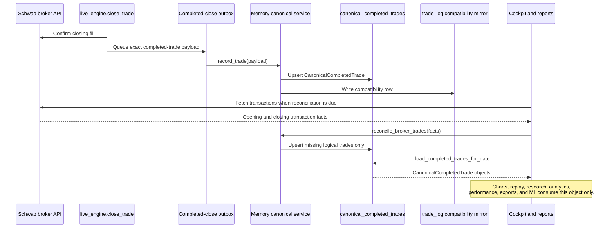

# Canonical Completed Trade Architecture

`canonical_completed_trades` is the immutable identity registry for completed
trades. `canonical_completed_trade_versions` stores append-only, versioned JSON
payloads. A corrected broker fact creates a new version under the same permanent
`canonical_trade_id`; no finalized version is edited in place. `trade_log` remains a
compatibility mirror for operational diagnostics; no downstream completed-trade
consumer should query it directly.

## Consumer Rule

Use `Memory.load_completed_trades_for_date()` or `Memory.load_completed_trades()`.
Do not construct display, review, analytics, or training trades from broker
transactions. Broker transactions are reconciliation facts and must enter via
`Memory.reconcile_broker_trades()`.

## Reconciliation Health

`GET /api/trade-reconciliation-health` reconciles current broker facts and
returns broker, canonical, review-export, replay-ready, unreconciled, and
pending-outbox counts. A healthy result has zero unreconciled trades and zero
pending outbox entries.

## Compatibility Migration

When a date is first read, completed legacy `trade_log` rows for that date are
backfilled into `canonical_completed_trades` with source
`legacy_trade_log_backfill`. This preserves historical data without allowing
new consumers to treat `trade_log` as the domain object.